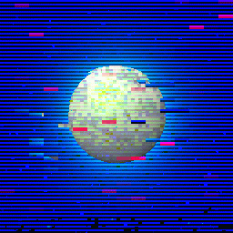

# Everyday One Motion - 20160121 "Artificial Glitch"

GLSL Glitch, Raymarcher, Metaball

[Demo Page](http://fms-cat.github.io/eom_20160121/)

## GLSL Glitch

一部の環境下で、GLSLシェーダの変数を明示的に初期化しない場合、確保したメモリに値が入ったままとなってしまうバグを利用したグリッチを利用  
定数を一箇所いじっただけで見た目が全然変わってしまったりしてすごく大変です…。  
グリッチの発生する原理は本当に天然由来ではありますが、ものすごい調整を加えて(=Artificial)それっぽく見せているグリッチではあります。  
ハードウェアによってグリッチする場合としない場合があります。MacBook Pro 13inchで動作  

## Metaball

今回はパーティクルから離れてレイマーチング。  
smooth minimum関数という、値がなめらかに変化するmin関数を利用するととても簡単にメタボールが描けます。  
smooth minimum関数は球体以外においても使えるため、メタキューブなどの物体についても、物体を距離関数で表現することさえ可能であればできてしまいます。  
[smooth minimum - Inigo Quilez](http://iquilezles.org/www/articles/smin/smin.htm)  

## 今回のパス
    - ノイズフィールド計算
    3 patterns {
      - レイマーチング
    }
    - グリッチトランジション用マップ作成
    - 3パターン間をグリッチトランジション

今回は安め。リアルタイムでも十分実行可能です
